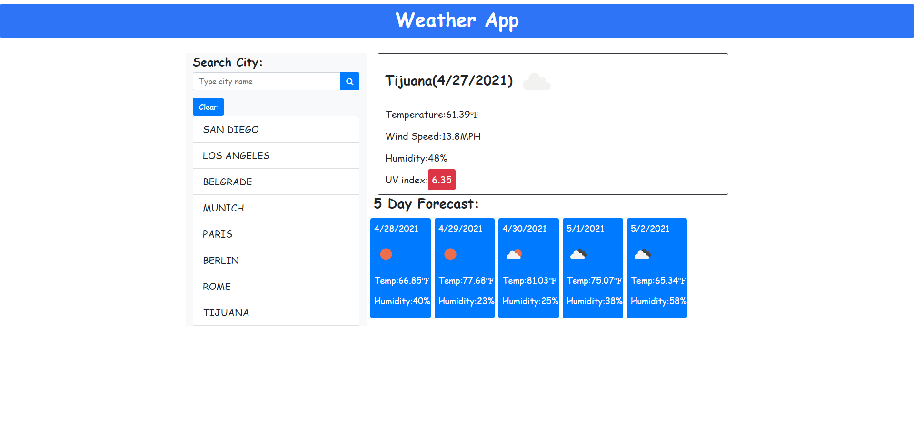

# 06_Weather_App

UCSD-SD-FSF-PT-03-2021-U-C-MW

## Github repository and published webpage links below

[GitHub link](https://github.com/djony88/06_Weather_App)

[Published Webpage](https://djony88.github.io/06_Weather_App/)

Requirements:

* Create weather dashboard with history of searched cities and multiple day forecast.
* When serched for specific city current conditions and for next 5 days are presented and city name is added to search history.
* In serched current weather condition presented are city name, current date, icon presenting current weather condition, temperature, humidity, wind speed and UV index.
* UV index is presented with diferent color wether the conditions are favorable, moderate, or severe.
* Future wether conditions are presented in 5-day forecast that is presented with date, an icon representation of weather conditions, temperature, and humidity.
* When clicked on city from history it presents again the current and future weather conditions for selected city.

HTML:

* Add bootstrap and linked CSS file.
* Added header.
* Added input box for "Type city name" placeholder.
* Added Search button.
* Added Clear button.
* Added current temperature, wind speed, humidity and UV index.
* Added future 5 day forecast.
* Linked JavaScript file.

CSS:

* Font syling
* 5 day forecast styling.
* Hover search history styling.

JavaScript:

* Variable declaration.
* Searches for City function to check if it exist in inputs from the storage.
* Added open Weather API key.
* Render current and future weather after user input.
* Ajax function.
* Added API url to get data from server.
* Added weather icon data from API server.
* Render current temperature and displays it in Farenheits.
* Render wind speed, humidity and UV index.
* Added URL for UV index API server data.
* 5 day forecast function. 
* User input search history list and display previos history on click from local storage.
* Clear search history button function.
* On click handlers.

